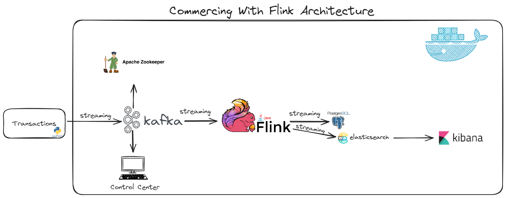
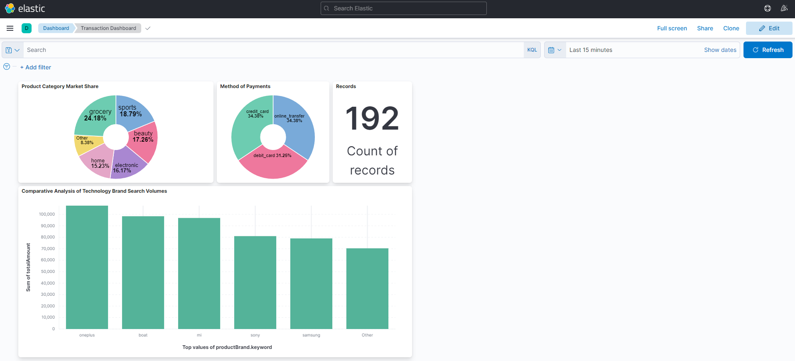

# E-Commerce Analytics with Apache Flink, Elasticsearch and Postgres

This project contains an Apache Flink application designed for real-time sales analytics, utilizing Docker Compose to orchestrate Apache Flink, Elasticsearch, and Postgres. 
The application efficiently processes financial transaction data from Kafka, executes aggregations, and stores the results in Postgres and Elasticsearch for comprehensive analysis.

## Requirements
- Docker
- Docker Compose

## Architecture
The architecture diagram below illustrates how the different components such as Apache Flink, Elasticsearch, and Postgres interact within this application:

## Installation and Setup
Follow these steps to set up the environment:
1. **Clone the Repository**: Download this repository to your local machine.
2. **Navigate to Directory**: Change to the directory containing the repository.
3. **Start Required Services**: Use `docker-compose up` to launch Apache Flink, Elasticsearch, and Postgres.
4. **Generate Sales Transactions**: Run `main.py`, the Sales Transaction Generator, to feed sales transactions into Kafka.
5. **Verify Container Status**: Check that all Docker containers are operational.
6. **Initialize Flink Application**: Begin the Flink application through the `DataStreamJob` class in the `FlinkCommerce` package.
7. **Data Storage in Flink**: Observe how Flink organizes transaction data and aggregated results in various tables like `transactions`, `sales_per_category`, `sales_per_day`, and `sales_per_month`.
8. **Analysis with Elasticsearch and Kibana**: Understand the role of Flink in storing transaction data for subsequent analysis using Elasticsearch and Kibana.

## Data from ElasticSearch and Kibana
The image below showcases sample data visualizations from ElasticSearch and Kibana, illustrating the insights that can be derived from the processed transaction data:

